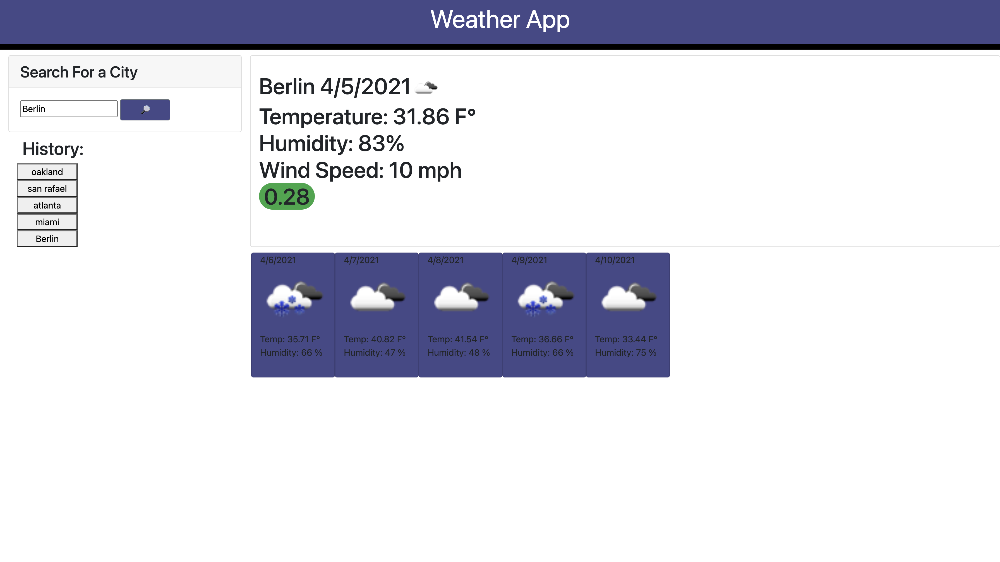

# Weather Dashboard

## Site Image

## Site Link
[Site](https://markosanchez800.github.io/weather-dashboard/)

## Technology Used
- HTML - Used to create basic framework of the site
- CSS - Used to give the element coloring, all other styling done through Bootstrap
- JavaScript - Used to give the site all of its actual functionality (Pulling data from openweather API and display it accurately on screen)
- Github - Used as the repository for site
- Gitbash - Used to commit and push code to Github as to track changes/progress
- Jquery - Used for streamlining code for easier typing
- Moment.js - Tracks day of the week and the following five days for a forecast
- Bootstrap - Gives page its presets styling and general aesthetic

## Summary 
This project was designed to show you weather all over the world.  Using the OpenWeather API the site pulls data for the city entered by the user and gives a daily forecast as well as information for the following five days.  Using dynamic element creation, each entered city is logged on the side as a button that upon being clicked will return that cities data again.  It also utilizes moment.js to give the day of the week for all the information the user is given.

## Code Snippet
    var displayUV = function(datas){
    uVee = datas.current.uvi;
    colorBox = document.createElement('h1');

    if (uVee <= 2){
      colorBox.setAttribute("class"," rounded-pill bg-success");
    } else if (uVee > 2 && uVee <= 5){
      colorBox.setAttribute("class"," rounded-pill bg-warning");
    } else if (uVee == 6 || uVee == 7){
      colorBox.setAttribute("class"," rounded-pill orange");  
    } else if (uVee > 7 && uVee < 11){
      colorBox.setAttribute("class","rounded-pill bg-danger");    
    } else if (uVee > 10){
      colorBox.setAttribute("class"," rounded-pill purp"); 
    }
    colorBox.innerHTML = uVee;
    windy.append(colorBox);
    }

### Author Links
- [LinkedIn](https://www.linkedin.com/in/marko-sanchez-800)
- [GitHub](https://github.com/markosanchez800)